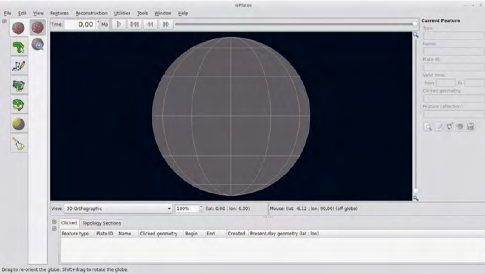

## Disobedient action research

"This is how as a method it links to what we call "disobedient action-research", it invokes and invites further remediations that can go from the academic paper to the bug report, from the narrative to the diagrammatic and from tool mis-use to in-terface re-design to the dance-floor. It provides us with inscriptions, de-scriptions and re-in-terpretations of a vocabulary that is developing all along.\" (Rocha and Snelting 2017, 45)

This is the point when this first person action research becomes a disobedient form of Action Research. This is because it makes room for these practices to move away from and refuse the institutional and hegemonic norms that a crip orientation of justice also refuses. Much like the disobedient demand of the *Crip Technoscience Manifesto* which I work with, and moves to access through friction (Hamraie and Fritsch 2019, 10), disobedient action poses us to take direct actions now! It aims to form futures within and around institutes that can't hold them yet, and defiantly practice politics that they are not ready to imagine. In the essay '*We Have Always Been Geohackers*' (2021) by Helen Pritchard, Jara Rocha and Femke Snelting, they position the methodology of Disobedient Action Research as a means to re-scope and re-think how we practice questioning, maintaining and developing sociotechnical systems and infrastructures. As they pose it through this essay, what does it mean to debug a system in the context of computing, its institutions and politics that hold it in place. In the contexts and configurations of their interventions, they ask how normative/obedient debugging in open source communities often reinforces systems instead of questioning and transforming them. Through their analysis they focus on how breaking up the "hardest problems" into "tiny" and "squeezable" bugs can limit what can be said and done. This question can also be easily applied through crip studies, where we could ask how does fitting into and assimilating to the institution's "squeezable" terms of access actually limit the contingent possibilities of change we could make otherwise?

In their essay they take up the debugging of Gplates, a free software tool and web-portal for tectonic plate modelling and mineral prediction for extraction. This debugging took place in a collective workshop where a group of non-technocrats, nor technical specialists  produced their own independent knowledge, expertise and critiques of how these systems figure tectonic movements and their volumetric predictions of mineral resources. Through these non-hegemonic counter figures, the group questioned the naturalised aesthetics and navigational tools of Gplates. This includes questioning the representations of the globe's default as a blank grey orb awaiting to be projected on us by the god like viewer (+@fig:grey), reinforced through to the time slider that lets you smoothly slide through "mega-annums of geological time" (ibid, 250). In questioning the software through these actions and reflections, they open up conversations of what agencies does the earth, and those bodies living on it have (ibid, 252-53). When a software has tool names orientating "grabbing", especially around land, minerals and bodies, what semantics, meaning and use does this inscribe (ibid, 252).

{#fig:grey}

Bringing these insights back to their critique of debugging. In this emerging practises that don't try to"isolate" these huge and complex issues so that they are squeezable within hegemonic logics of debugging. Instead try to feel out and validate situated, nuanced and ephemeral critiques that can't be reproducible for a developer or for a rigorous study. This is where they encourage me[^q2] to be disobedient to these norms and instead of scaling down bugs, try to practice them across scales of time and space, displacing and intersecting the iterations and versions across software development.

Much like Ahmed's relating to lesbian roles of butch-femme as performances and not determined roles that I cover in [01.01.02_Queering_the_axis](../../01_Disability_justice_and_life_affirmation_flipping_the_table/01_entries/01.01.02_Queering_the_axis.md), being disobedient doesn't aim to reject or discredit fields of expertise, practices, scales and knowledges that it works with but to trouble their performances and problematize their aftermath. This orients these disobedient actions, so I aim to feel their frictions and to question how technical systems are imagined, executed and orientated, moving to figure out how I (and others) can imagine and practise with them otherwise. Intersecting here with a crip set of political/relational scales, this refuses access and equality through assimilation or prescribed terms, but instead makes room to locally image sets of demands and actions to make. Here I reflect to Collin Kennedy, who is mentioned in the *Crip Techniscience Manifesto*, and I touched upon earlier in  [01.02.04_Cripping_Technoscience](../../01_Disability_justice_and_life_affirmation_flipping_the_table/01_entries/01.02.04_Cripping_Technoscience.md),. His refusal to pay to park, and access his care is radically out of the bugs an access form is imagined to hold, but also questions time, relational access, and capitalised care.

The Gplates debugging in We Have Always Been Geohackers (ibid) is only one of a number that they have taken on. These later impositions through their organisation *The Institute for Technology in the Public Interest* (TITiPI) and with many collaborators. Through these instances they are practising disobedience to the norms of big tech's expansive and violent development. They inquire into how they can gain purchase and get to grips with what they have capacity to change through challenging the sedimentations of norms and taking direct action to re-orient them now. Other examples of these intersections take place on github where through these disobedient terms of action research they enthusiastically are "always-already entangled"(Barad 2007). With "The long tail of contact tracing"(Aouragh, Pritchard, and Snelting 2020b; 2020a) they pose some of these "Hardest Problems" to contact tracing technologies during the Covid pandemic and their norms towards surveillance methods and discrimination on the DP-3T (Decentralised Privacy - Preserving Proximity Tracing ) documents repository. In the DP-3T repo[^q3], as a place already somewhat critical of the hegemonic centralised norms of other contact tracing algorithms, welcomed these critiques and conversations, and these direct provocations evoked dialogue within that development community. Other repos did not respond in a similar way.

In *EU Digital COVID Certificates: When governments move fast and break things* (Aouragh et al. 2021b; 2021a) a critique of the EU DCC (Digital Covid Certificate), this was not the same case. Their commentary in the issue post/bug report was that a new idtoken which tracks each person's COVID status and (dis/en)ables them travel and move, as being something that we should be very cautious of. This is especially the case when there are no safeguards around who can read and use the data stored in the QR codes. This is also doubled by the fact that many of the medical infrastructures in Europe are not fully digitised, and this approach enforces them to "scale up" these specific digital surveillance systems immediately to comply. They point out that such quick move to restrictive measures through digital surveillance infrastructures will undoubtedly hit many issues, which in these cases will deeply affect the lives of people "cared" for by these systems. Here the disobedient debugging was not met by the same sort of reception as on the DP-3T post, but instead was within a day commented on[^q4] to say it was in the wrong section (a technical forum) for this type of discussion. As in it was not a squeezable bug they would accept. It was then immediately closed and moved to a limited discussion for just private collaborators of the repo.

Another example of disobedience from them is in their bug report of Frontier Climate (Aouragh et al. \[2017\] 2024a; \[2017\] 2024b) where they critique Big Techs selling of carbon credits and offset as a means to not reduce, but expand carbon exploration and dependency. This debugging showed a different face than the rest, as Frontier totally deleted the post. This move to delete, instead of the normative sideline, close down and avoid, shows the power of these comments and their direct actions to that company. It shows how these critiques if tabled could potentially reorient things, so have to be thrown off.

These disobedient intersections not only, as said in Pritchard's talk at 4S\*EASST (2024), "give feedback where it is not always wanted", but in this direct action of giving feedback to them publicly it shows us how receptive these organisations and projects are to scaled up bugs. In their response we can publicly note if they listen and join the discussion. In this we can also feel them wriggle as they (not so) subtly restrict the bug to a side room away from discourse. When they give this feedback and try to get to grips with these scaled up buds, it is easy to know when they pull away, and into retreat as they delete the commentary from existence. In these disobedient actions they force the hand of the repository/software maintainer to not only engage with political commentary and critiques, but to also position themselves in relation to it publicly. Do they engage, avoid or squeeze these bugs however possible? are they too big for them to manage and so they avoid or do they feel their hold so delete them out of existence? Here I am thinking of disobedience as a practice to change how dynamics are performed to show relations, people and bodies under another spectrum, and to figure out what roles they perform when taken off script. Reflecting back to [01.02.04_Cripping_Technoscience](../../01_Disability_justice_and_life_affirmation_flipping_the_table/01_entries/01.02.04_Cripping_Technoscience.md), these practices align with those of access as friction, and that of the "non-compliant user", wiggling room for dialogues where they have been silenced.

Another key part of this "giving feedback where it is not always wanted" is that of making room for and building up this feedback that is not wanted. It is about collectively telling other stories of technologies, infrastructures and policies, than the rhetoric of their management. Here we can turn to TITiPI and friends work on infrables (2022), where they present methods for building up bugs from embodied and experienced relations of infrastructure. These methods not only build from those of first-person action research but also follow on from a crip orienting from the sites of impact of infrastructure and politics to inform the change needed. The work of infrables takes these processes on by developing a collaborative workshop and practice to unfold these other stories of Big Tech infrastructures. In this workshop practising ways to perform and transform anecdotes of infrastructures and their institutions into fables that can challenge those of mainstream and dominant narratives. 

Bringing this into crip centred methods, I turn to the work of Nat Decker and Cielo Saucedo's *Cripping_Computer_Graphics* (2023). Here they similarly offer up how cripping as method makes wiggle room for crip bodies within 3D environments, as well as wider relations and norms of computation institutions. Here taking up Dr. Carrie Sandahl terming of "cripping" (2003, 37) as method to make room to feel the disorientations of crip bodies in relations to the norms of these technologies. Here they question how the diversity and many intersections of crip bodies disorient the normalised forms and mechanics of computer graphics, from the avatars to the ways they are rigged, and even how these virtual bodies are licensed and sold. Here they again make room for their crip expertise to question the sedimented bodies and limits of these systems.

As I shared in the  last two chapters the dominant terms are ones of silencing disabled and frictious voices to keep the narrative straight and to rule out any queries. By making room to tell these counter stories, and disobediently performing them as fables, this work aims to disorient how infrastructures and their aftermaths are felt and understood through centring the expertise and knowledges of the communities they are in touch with. These impact centred method are where I bring in these embodied elements of action research, of working with crip practitioner knowledge to animate the lines that are drawn and what is naturalised and sedimented as the norm.

[^q2]: "We need a cross-platform, intersoftware, intracommunity, transgenealogical way of reporting that, instead of making bugs smaller, scales them up in time and space and that can merge untested displacements and intersections into its versioning ladder."(Pritchard, Rocha, and Snelting 2021, 250)
[^q3]: Repo or repository, is a place for storing code, files and resources, which is organised through a varying set of version control and management protocols that enable the owner to manage a stable up to date version of its content.
[^q4]: "As this is not a technical issue with the specification, I will move this to the discussion forum."(Aouragh et al. 2021a)
