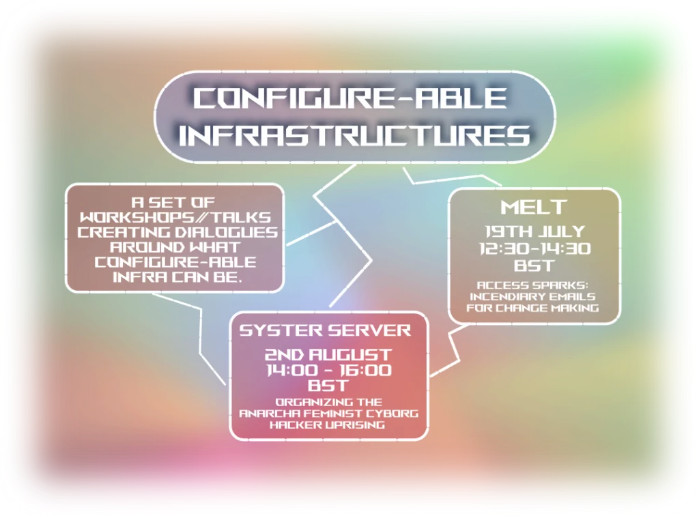

These workshops were organised with NEoN digital to make room to explore queer, feminist and crip methods towards network infrastructures. In these workshops I collaborated with MELT and members of SysterServer to run two workshops share how collective access can be understood through digital networks. 

https://neondigitalarts.com/configure-able-infrastructures/