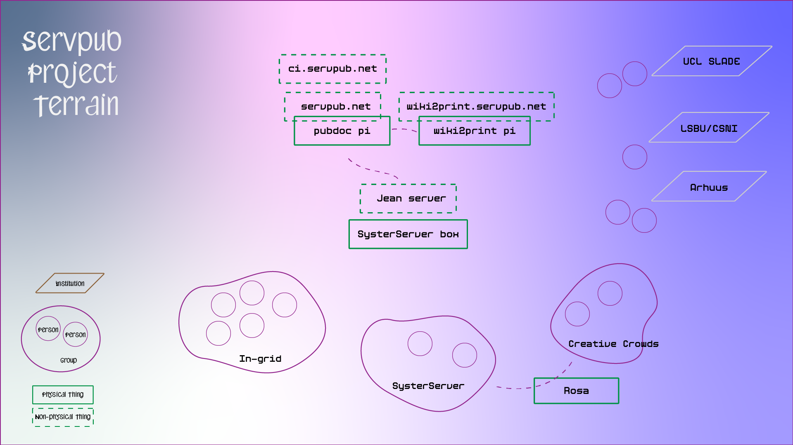
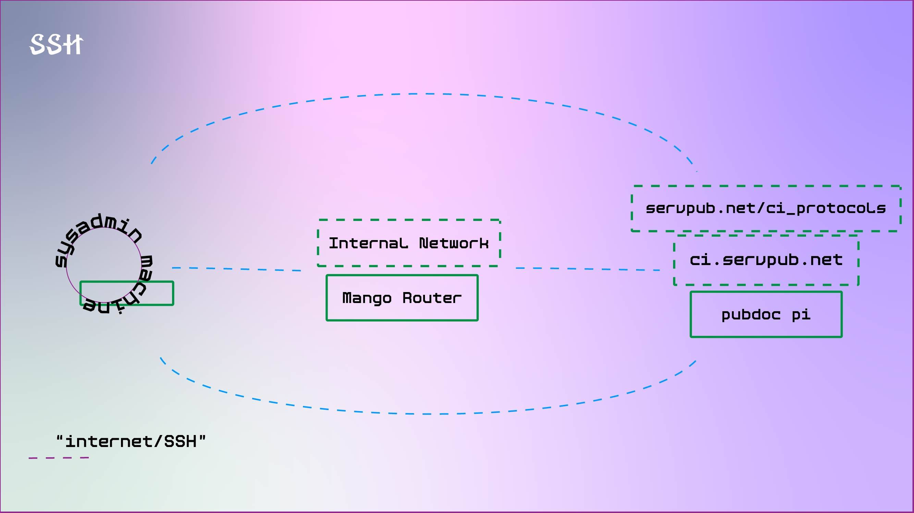
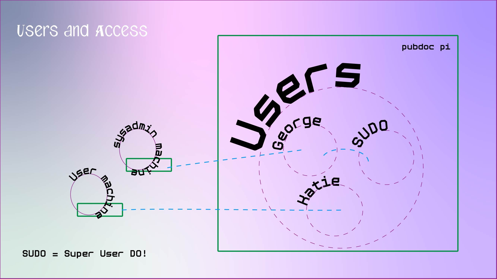

---
cssclasses:
  - femfester
---


#  (¬_¬)/\` Serv(er)ing In-grid

---
# Workshop Outline 

In this workshop I aim for us to think about how we make and imagine collective places of infrastructure. In this exchange we will materially and technically setup a server space, and along that journey together we will ask questions and discuss how we want to practice these technologies collectively.

The end goal is to have collectively edited set of protocols or a manifesto that we publish to an html page on the server.

---
## Workshop Acknowledgements

Material for this workshop was developed from collaborative work over a number of iterations from projects including servpub, collective infrastructures and cozy-cloud.

Outcomes from this workshop will also be used in my PhD as well as published in the new Servus journal? (I think it is) And I will make sure we are all credited!

---

## Infrastructural Acknowledgements

This workshop and the server are hosted by Servus in Linx Austria. They are an artist run data centre and have given us this space to practice our own network tech and projects. It is run on hydro electric energy and hosts a number of other collectives, tech enthusiasts and artists.

---
## Femfester?
### Protocols \* Manifesto

We will  be making and editing a manifesto of sorts as we work through the steps of this workshop. 

These will be hosted on an html file on the server, and is accessible at this URL page: https://femfester.in-grid.io/

Until then we will edit them on this pad: [https://digitalcare.noho.st/pad/p/Femfester](https://digitalcare.noho.st/pad/p/Femfester)

> p.s. Femfester can be changed.

---
### Why thinking through protocols?

When it comes to making collaborative community driven sociotechnical infrastructure, there is always a complex network of relations that we have to work through. Negotiating every relation when we enter a space could be very complex and time consuming, as we will see, but setting protocols helps us firm up ways of working and relational conventions that ease this flow. Through setting these protocols together we mean to disobey the norms of network infrastructures and actively re-scope how we come to these systems and relations together.

---
#### Diagram: of socio-technical relations of Servpub project 



---
#### Why thinking through Manifesto?

Relating to [original feminist server manifesto](https://areyoubeingserved.constantvzw.org/Summit_afterlife.xhtml) by some of [Constant](https://constantvzw.org/).  Manifesting and imagining what a feminist server is and does.

```
A feminist server… 

* Is a situated technology. She has a sense of context and considers herself to be part of an ecology of practices
* Is run for and by a community that cares enough for h
er in order to make her exist
* Builds on the materiality of software, hardware and the bodies gathered around it
* Opens herself to expose processes, tools, sources, habits, patterns
* Does not strive for seamlessness. Talk of transparency too often signals that something is being made invisible
* Avoids efficiency, ease-of-use, scalability and immediacy because they can be traps
* Knows that networking is actually an awkward, promiscuous and parasitic practice
* Is autonomous in the sense that she decides for her own dependencies
* Radically questions the conditions for serving and service; experiments with changing client-server relations where she can
* Treats network technology as part of a social reality
* Wants networks to be mutable and read-write accessible
* Does not confuse safety with security
* Takes the risk of exposing her insecurity
* Tries hard not to apologize when she is sometimes not available
```

---

## Why Femfester tho?

Manifesto = Man x   Infest

> Infest being the taking hold of and grasping threateningly at things as proof! 

Femfester = Feminism x Fistula

> Fistula being part of an festering, a pipeline with many holes. Thinking of a patchwork infra!

We can change this, it was just me having fun with wordz.

---
# Lets put it to practice

---

# Pre word

You can have a lot of passwords and bits here, so I use a password manager like [Keypassxc](https://keepassxc.org/)

---
# 1. Intro terminal software


Lets give a little context of working with computers.

---

### GUI


So most people are probably used to working through a **graphical user interface** (GUI), which is a relatively recent way of interfacing with a computer. This is great for accessibility but also tends to scope and direct the abilities and capacities you have on your computer, as in there are only so many buttons or things you can show in a communicable way. 

---
### Terminal

ing%20in-grid/media/howdyTerminal.png)

Terminal is a more classic way of working with a machine, and roughly speaking is the step between punch-card/magnetic tape style computing and a GUI. It is a very simple but powerful interface that lets you run basically any command on your system through a text interface. Compared to a GUI this space is more "risky" as you can do anything from anywhere, such as deleting the entire operating system (not advised). It also means that there are no limitations to your system administration so you have access to a granular level of working. 

---

## Coding Protocols

> [!question] Prompt
>When entering into this more "risky" space on a computer network, it is good to set some intentions and work out how to move through this space with care. As we go though these next steps getting into terminal have a think about what it means to be in this place of power/risk, and what relations you think you need to care for in the formation of these protocols?
>
>It can also be a great place to think about if/how the relations of a system enables you to  perform this role of power, and what change in relations this new role brings with it. 

---

# 2. Accessing Terminal 

This depends on your platform, so...

---

## Mac & Linux

On a Mac it is already installed! So all you need to do is:
1. Search up Terminal
2. Open it!
---
## Windows

There are similar programs to terminal already installed, but not the same language (bash). There are a few ways to do this, but I recomend installing an ubuntu vm shell for bash, as it gives the most capability for this use case:
1. Install the VM from the windows store [HERE](https://www.microsoft.com/store/productId/9PDXGNCFSCZV?ocid=pdpshare)and remember your password!
2. Then open it up!


---
# 3. Intro to Terminal Commands

As we said before terminal is a text/syntax-based way of interfacing your machine and we are going to introduce a few basic commands and concepts to get us going today.

---
## Say Hi!

Let's simply use `echo` to get our terminal to say HI!.

To do this use:
``` bash
echo <message>
```

e.g.
``` bash
echo HI!
```

---
## Who are you?

Now lets see who your computer!

Show the name of the currently logged in user:

```shell
whoami
```

Show the name of the machine is given on the network:

```shell
hostname
```

---
## Structure + Navigation

Much of working on the command line involves navigating around your system without the use of a Graphical User Interface (GUI).

However, we will essentially be navigating around normal computer folder hierarchies like below:

```
root/
├─ directoryname/
       ├─ anotherdirectory/
                  ├─ aFileName.txt
```

---

**Directory** : also known as a folder

Print working directory that you are currently in:

```shell
pwd
```

List current directory contents:

```shell
ls
```

---
## Moving around

Now to move between directories/folders we use `cd`  like so

``` bash
cd <directory_name>
```

e.g.
``` bash
cd folder1
```


>We can use a folder that was shown with `ls` in the last step!
>You can also check whats in the new folder with `ls` to see that you have moved.

---
## Writing Terminal Protocols

> [!question] Prompt
> In this potentially unfamiliar space how do we keep track of where we are, what we've done & what commands we may need in the future?
> 
> Basically how do we want to orient ourselves?

---
# 3. Intro to SSH

Secure Shell (SSH) is a way of working on another machine from your own, working in their shell (bash). 

It basically lets you work on another computers terminal remotely. This is the way you will work on most servers or remote/faceless computers (computers without a screen).

---

## SSH Protocol


---
The SSH protocol enables us to talk securely to our server by encrypting and authenticating all of our communication/interfacing through the network. 

Traditionally tech has a metaphor of SSH as a secure hand shake protocol, but it will be great to think about what metaphor or relation we want when it comes to crossing boundaries and into shared spaces. 

Do we want to hand shake or do we think . . . would enable . . . 

---

## Installing SSH

Again this may be a bit different on different systems, as some will have this already installed and some will need to install it. 

Install it with:

``` shell
sudo apt install openssh-client
```

If you are on gitbash on windows, it should be installed.

---

## The IP address of the server!

To SSH into the Server with servus  we need to use their IP!

An IP address is basically the postcode/address we will find the pi at on the network.

The IP for our Servus server is:
`193.170.194.204`

But we also have it as a named server:
`vps.in-grid.io`

---

## SSH into the server

Now that we have the IP address, any computer can request to SSH into the server through these commands:
``` shell
ssh <user_name>@<ip>
```
eg.
``` shell
ssh in-grid@193.170.194.204
```
or
``` shell
ssh in-grid@vps.in-grid.io
```

You are now "logging into" our server, so it will ask for the password here and that I will share with you.


---
## Are we in there?

You should now see your terminal username change from your laptop's local user to something like: 

``` shell
in-grid@vps:~$ 
```

If you want to exit out of the pi (we don't atm) type:

``` shell
exit
```

Hit enter. You will need to have exited the pi before setting up your ssh key. 

---
## Writing SSH protocols

> [!question] Prompt
> How do we navigate another machine through our own "interface"?
> What are the relational agreements to being on this other machine?

---
# 4. Entering into sudo

Sudo enables us to take on a **superuser role**.
This means that we have all the security permissions for that system. This is a "very risky" role, as here you can do anything on the server/computer. With sudo you can actually delete the entire system or make other similar drastic commands, but it also means that we have the ability to manage and configure our system to our needs.

When we come to writing protocols for sudo, what does it mean for us to be a "superuser" or an admin, and what care and consideration should we take on in these protocols?

---



---
## Becoming sudo

To become sudo or root you just need to:
``` shell
sudo su
```

And then enter the password when prompted.

---
## Writing sudo protocols

> [!question] Prompt
> Super User can Do! a lot... what permissions are we comfortable navigating?
> How intimate are we with our machines?

---
# 5. Intro to shared server

Caring for a server includes routine tasks like updating/upgrading the system software, tiding up files, creating new users & giving access permissions, paying attention to errors and bug reports.

We are going to initiate this server by making us all users!

---


---
## Creating Users

To make a new user, use the command below. Note, that you will be prompted to input a password and it is always better to give different users passwords
```shell
adduser <nameofuser>
```

---
## Making them sudo!

If you want to give this user sudo access, then they have to be added to the "sudo" group. You don't need to create this group, it exists by default and you can just add or remove users from it. The sudo group is stored in this directory: /etc/sudoers.d/

```bash
usermod -aG sudo <nameofuser>
```

You can check to see who is in the group sudo using this command:
``` bash
 grep '^sudo:.*$' /etc/group
```

---
## Swap user

Now you can change into the new user (in other words, sign into their account):
```shell
su <nameofuser>
```

---
## Log in

You could also log in now with:
``` shell
ssh <username>@193.170.194.204
```
or
``` shell
ssh <username>@vps.in-grid.io
```

And log in with the password you just added.

---
## Writing user protocols

> [!question] Prompt
> How can we re-imagine users to something less explicit and more gentle?
> How do we want to configure the imaginaries to these roles?

---
# 6. Security via SSH Keys

SSH Keys are user specific and are used in addition to a shared login password. To make this method of access truly secure we will need to eventually disable password-only login. 
	
The shared password is the Lock, and the private password is the Key. Keys are non-transferable and have to be generated per user. 

Make sure you are back on your own system with:
``` bash
exit
```

Then to generate the keys, call this command: 

``` shell
ssh-keygen -t rsa
```

Fill in the information requested (note: most of it is optional so you can leave it blank) and set a password (not optional).

---
## Generated Keys

The shared key is the:

`id_rsa.pub`

and the private Key is the:

`id_rsa` 

Make note of the path to your id_rsa.pub, we'll need it in the next step.

---
## Share keys to server

The public, Lock, password now needs to be copied over to the raspberry pi. Do this via this command (replacing the first bracket with the path to the id_rsa.pub, and the second to the Pis IP address, which we found earlier):

``` shell
ssh-copy-id -i <path to id_rsa.pub> <username>@vps.in-grid.io
```

Enter password to complete transfer.

---
## Log into server

I find it easiest to login with the key linked directly.

``` shell
sudo ssh -i <path/to/id_rsa.pub> <username>@vps.in-grid.io
```

>[!Note]
>Maybe check you can become sudo with `sudo su`

---
## Disabling password access

_Only do this after everyone who need to access the server has uploaded their Keys!_

It is also recommended that you keep one person ssh'd in at all times during testing this, so if you do something wrong you can unlock it again.

Access the config file by:

``` shell
sudo nano -l /etc/ssh/sshd_config
```

---

And in uncomment 'PasswordAuthentication' on line 57 and set to 'no', then save and exit:

``` config
PasswordAuthentication no
```

Then restart the SSH connection:

``` shell
sudo service ssh restart
```

---
## Test

Keep someone logged in at all times!

Have someone else log out and back in, trying with a password which should fail, and then the key which should work!

---
## Writing digital safe space protocols

> [!question] Prompt
> Now this server is "safe" and secure, can we reflect on what that means to us?
> How do we imagine this server being a safe space beyond SSH keys?

---
# 7. Intro to Tmux 

Tmux is what is called a multiplexer, which is a software that lets us collectively work one terminal session. 

This is how many collectives and collaborative networks work together on servers in one space. It lets us edit and run commands in one space and take responsibility and practice our infra becoming together.

When we come to writing protocols we might want to think about what it means to be one user together, and how can we keep everyone at the same pace and comfortable levels of understanding. 

---
## Making a collective session

All become sudo with:
``` sh
sudo su
```

Now we are all `sudo` we can initiate a shared session to work in together.

To do this we use:
```shell
tmux new -s <session name>
```
e.g. 
```shell
tmux new -s in-sesh
```

Now we need to name our collective space. If we think back\*forward in this workshop, what are the intentions, dynamics and relations we want to collectively name this space with?

---
# Joining our session

Now we have an active session we can join it by just typing:
``` shell
tmux a -t in-sesh
```

> Rember we have to be sudo to join this!

---
## Saying hi to each other!

Now we can say hi to one another and say cute messages in the space by:
``` shell
echo <message>
```

Say something to welcome each other into this session, you may need to take turns.

---
## Collective working protocols

As we saw even each of us writing an echo command takes a little bit of choreographing. When this gets more complicated, like writing complex configuration files, you can imagine it gets even more tricky.

> [!question] Prompt
>So here we need to think about how we might manage collective editing. What operational metaphor might we use to describe the relationship between the person typing and the others? Who and how do we choose to type? How do we take care of every voice in that conversation?

---
# 8. Collectively editing

We've created a simple html document to edit. We need to navigate to that file, open and edit it. 

First lets navigate to the folder its inside and list its contents.

``` shell
cd /var/www/femfester
ls
```

We should see a file called:

index.html`


---
## Editing the HTML

Now we are in the right folder we can edit the file with **nano** which is a terminal base text editor. 

To open the file with **nano** we do:
``` shell
nano index.html
```

This will open the file in the terminal.

---
### This should look something like this

ing%20in-grid/media/nanoOfHTML.png)

> [!tip] 
> Being terminal you have to navigate with the keyboard, and also copy and past by right clicking (not "CNTRL+C/P")

---
## Adding to the file

From here we can then add text and images using basic HTML syntax.

For the time being we are going to just add fun bits to see it work, as we have some more protocols to write and add.

So for now add a message or paste in some ascii art with the help of these links:

[ascii text gen](http://www.patorjk.com/software/taag/)

[ascii image gen](https://www.ascii-art-generator.org/)

> [!tip] Remember to paste in with a right click!

---
## Seeing our page!

Now if we return to the file online at:

https://femfester.in-grid.io

we will see our beautiful inputs.

---
### Writing the protocols

> [!question] prompt
> How do we negotiate the space of working collectively as one user?
> What other considerations need to be voiced?


---
# 8. Exit safely 

When we finish up working together there are lots of things we can do to make it easier to return to our work, make it legible to others, as well as caring for the infrastructure we're working in. This could include careful documentation, understanding how to save and record edits, and exiting programs in their nuanced ways.

---
### Exiting Tmux

We've finished working together and now we would like to leave our TMUX session. This is a little more complex than it might appear. Leaving a session using an 'exit' command will delete the session for others, and you will lose the record of your edits together. Instead we can either:

Close the entire terminal session window, or use Ctrl-b. This will retain the terminal session for you to use again in the future. 

---
# Exiting safely

Let's consider collectively how to ensure we exit safely, using a door rather than an ejector seat. How does this action differ from exiting other softwares and how does this attention affect our relationships.

> [!question] prompt
> How can we form protocols that enable us to care for who is coming next and which 

---
# 9. Publish protocols

Now we have all the protocols ready lets add them to the HTML file with **nano** again.

Once we have edited the HTML, we can launch our page in a browser! 

At https://femfester.in-grid.io/

---

# We did it!

Practising infrastructuring collectively can be (intentionally) a slow, careful and unscalable process, so it's important to acknowledge our incremental changes, achievements and presence. 

---
### Reflections

---
### Resources for maintainable practices

[Our (ongoing) documentation](https://wiki4print.servpub.net/index.php?title=Docs:00_Contents#Index_of_Sections)
  