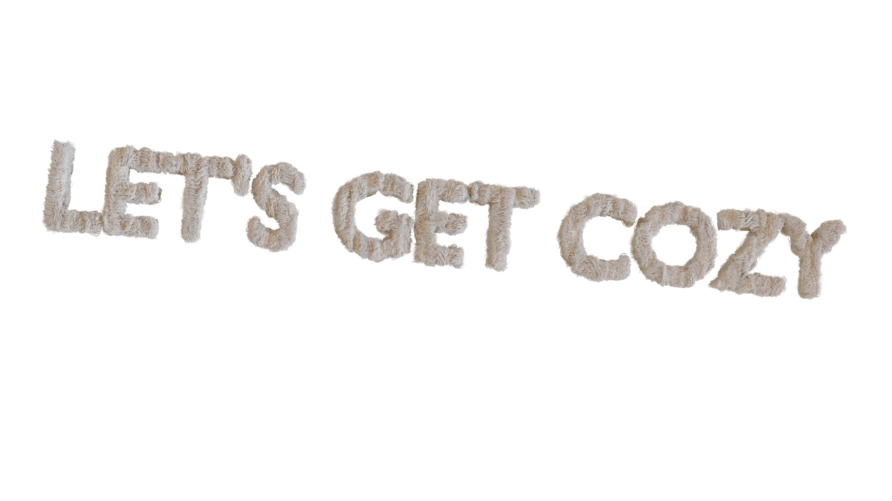
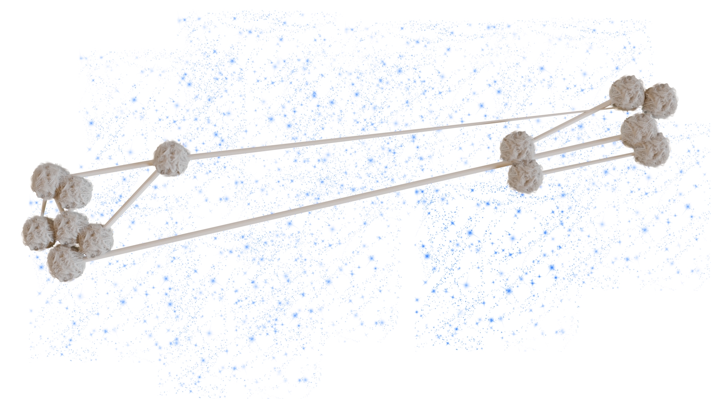

---
cssclasses:
  - cozy_NightDay
---

This page brings together cozy intentions for the cozy-cloud crip (disability justice) space. This is to give an understanding of how * why this crip centred platform came to be and to share some of the desires we have when making an affirmative digital space that centres disabled people.

These intentions appear as image and alt text pairs, each defining its own thread to be followed, weaving together a story or figuring of the cozy-cloud. In a classic crip move, they entangle together the affective feelings of our mind * body and their knowledges, within an understanding of political * relational modelling to imagine new ways to transform our social * technical infrastructures. 

Simply put these intentions mean to affirm what we feel as disabled people in both our bodies and minds, and to enable those knowledges at the centre of transforming digital communication networks and systems like social media platforms. **maybe something about enviro x material**

These intentions ask: If we as disabled * neurodiverse * chronically ill people are able to transform digital spaces and communities and their material infrastructure (+ the environmental effects they have) from a space of crip care and time, what could that look like and feel like?

If you are a member of the [cozy-cloud](https://care.cozy-cloud.net/) platform and want to add to or tweak these intentions and you have not had the opportunity yet please message  [COZY](https://care.cozy-cloud.net/u/COZY) for the etherpad they are edited on.

---

## Let's Get Cozy

### alt-text: 
Furry text saying "Let's Get Cozy", welcomes you to get cozy! This is an enthusiastic and loving message reminding you to get cozy in what ever way you are able to.

Many times (not always) when we can't get cozy,our experience it is telling us that something might be wrong systemically. This text asks us to think, what would enable me to get cozy? What relations would have to change for us to actually be cozy? By trying to get cozy we start to make these transformations, so settle in and lets get cozy.

---

## A Cozy Looking Cloud

### alt-text:
A cloud sits unsure on a day with mixed weather. It feels sensitive to the gusts and gales of bigger clouds and so searches for a sheltered valley to get cozy and come back to earth. 

It asks us to think about how we feel in the cloud. When we are using cloud enabled devices, like streaming, cloud drives or social platforms do we feel a connection to what it is we are doing? What would it feel like to ground and get cozy with our digital infrastructures.

---

## Less Cloud More Cozy

### alt-text:
The cozy-cloud sits within a ring of furry and cozy text saying "Less Cloud - More Cozy". It feels warmth in knowing its energies are conserved for doing cozy things and not being a part of deadly storms elsewhere. 

It asks us to think about less dispersion of our digital selves into a commercial cloud that displaces the harms of digital infrastructures out of sight. How can we settle in, keep ourselves close and feel out how cozy our clouds could be?

---

## Clouds are finite :( Coziness can be infinite

### alt-text:
Slightly clumsy but cute furry text says "Clouds are finite :( Coziness can be infinite!". It sits slightly slumped to one side, exhausted with keeping up with the continuous expansion. 

It helps us to reflect on the limitations of computing and cloud infrastructures, the consumption of fossil fuels, rare minerals and people's labour to try to maintain the unmaintainable infinite growth. What if we centre our clouds on other infinities of care, compassion and coziness? What would infrastructures feel like and be able of through these gentler modes?

---

## Transform networks of control 2 constellations of care

### alt-text:
A map of arpnet, the first computer network produced by the us gov/army is transformed into a cozy-constellation. This transformation resembles the way digital networks have a history of control of space (both physical and virtual) through force and how we have to transform them with care and coziness.

It asks us how we could imagine networks away from these histories of mapping, taxonomy and creating specific ways of knowing/doing? Instead can we imagine it as a set of unknowable stars, a relation of gravitates to be felt but unknown felt from afar? 

---

## This is a cloud

### alt-text:
A png of a cloud with transparent background so that it looks like it is comfortable and confident wherever it is displayed. The cloud looks so light and pretty floating on the page, but still on the edge of creating a little drizzle. The image itself is also on a free license so is free like a cloud!

It reminds us what a cloud looks like and what it is able of. The computational infrastructures that make up the commercial cloud could never be so light nor caring to our ecology nor our body/minds. What metaphors or analogies would you give the cloud? How would you transform them through putting this digital infrastructure in your own terms.

---

