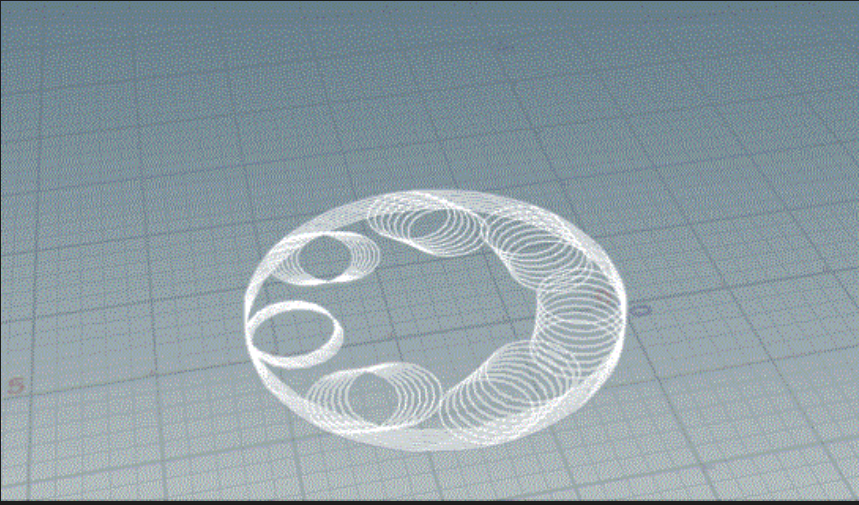

### Texture 1

{#fig:cyclez}

At the beginning of this PhD I made this animation to reflect on how I was imagining Action Research as a method that would take me through loops of inner and outer arcs, ones that will build up, offset and emerge other forms of inquiry. Looking back at this animation the cycles presented imagine them as quite linear and deterministic. The form these cycles build up into are also somewhat walled in, hiding the inner arcs and sub-cycles of process. This texture gave me grip to get going, and has through inquiry emerged itself into the [04.04.02_Texture_2](04.04.02_Texture_2.md). This cycle got jolted open into these disobedient forms below through an inner arc of engagement with crip theory that emerged a desire to engage more deeply with those I am in coalition with as well as making what actions are and can be reachable through other disobedient practices. What can be unravelled and made barrier free.
