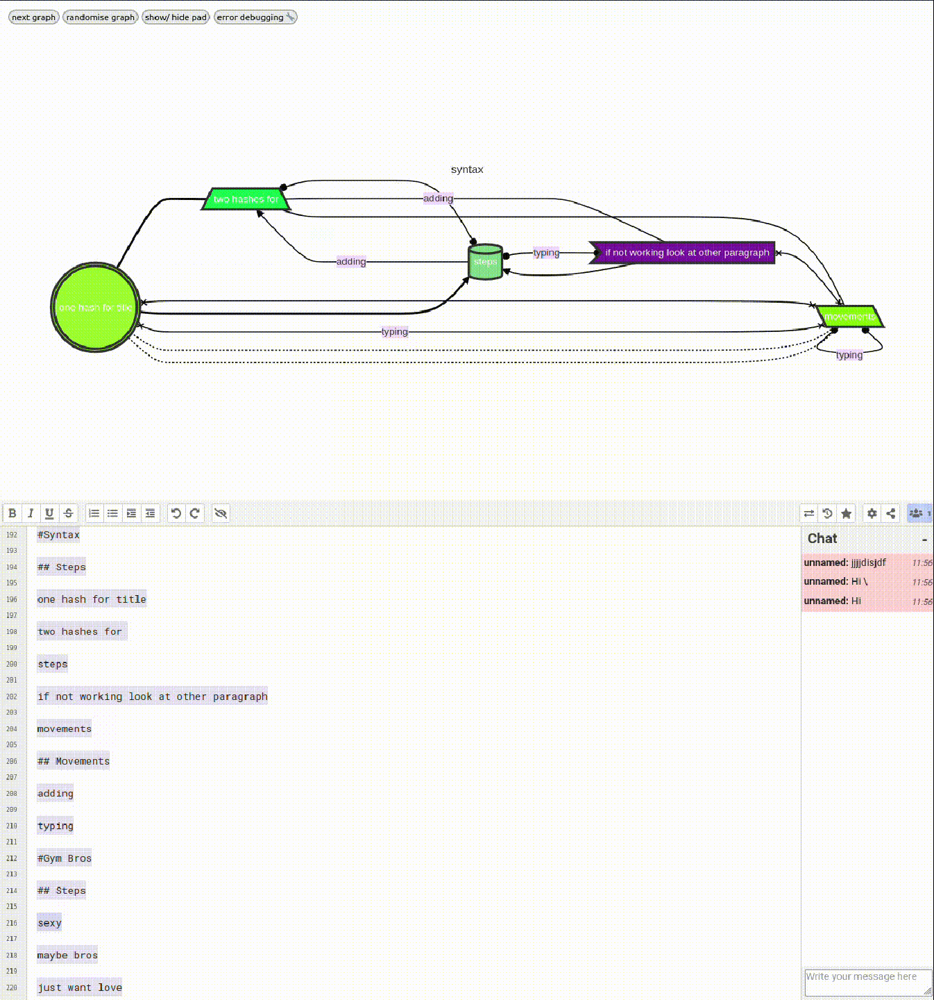

### Texture 2

{#fig:loops}

This texture and artwork came about as I was trying to reflectively figure out how these disobedient actions had taken place. This texture takes the form of a poem visualiser that pulls from collective written texts in an etherpad and dynamically produces complex and indeterminate diagrams with a multiplicity of paths and connections between the lines/nodes of the poem (+@fig:loops). It is also made to be audio reactive so it can generate diagrams in-sync to music as visuals. This work was produced in collaboration with Sunni Liao and Yewen Jin (members of In-grid[^q5]) for an event called *In-grid.Real\_bodies2.1*[^l1] that In-grid held in 2024 at Avalon Cafe and performed live in collaboration with the audience. The work acting as a texture in this research opens up the disobedient actions to be less determinable cycles and into poetic movements, both in content and connection. It also opens up these actions to be public, to be intersect-able, barrier free (ish) and accessible, moving from the isolated static spiral to instead be engulfed in the rhythms of music, dancing and collective being. Its context has moved from an isolated animation, and determinable rendering, through to making room for an accessible, dynamic and pleasurable tool or infrastructure, made with and for collaboration. In a disobedient move here this methodology refuses to isolate in this study and instead moves from the shared pad to the poem to the diagram to the dance floor to the here on the academic thesis (but also to the \*\*\*\*\*[^q6]).

If you want to try it out, see what\'s happened there and maybe intersect into a texture of this methodology you can try it [HERE](https://georgie-png.github.io/etherpad-vis/).

[^q5]: In-grid is a Trans\*Feminist collective who I helped to set up and work with throughout this research.
[^q6]: "This chronic job, by stating all the cron variables of time as \*, refuses such linear computational metrics to instead hold the past\*present\*future, future\*past\*present, and \* \* \* \* \* of crip times." (Simms and Marangoni 2025)
[^l1]: https://www.in-grid.io/projects/real-bodies-2.1/