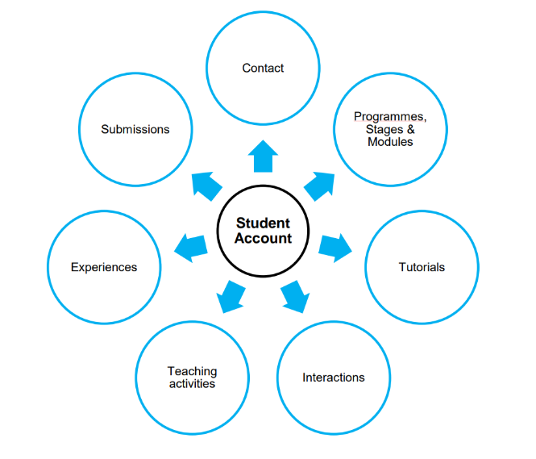

## The computing table

Here I am opening up the computing table and navigating to an inquiry of the ex-cell (excel) table of institutional databases and the automation of their administrative logics. I am approaching this through two avenues here, though there are many other approaches I could take. The first is to reflect on how I as an individual have systemically by multiple institutions been placed and prescribed to specific cells within tables by others as they translate my experience into evidence to validate my care. Here I am thinking this through with Mia Mingus' *Forced Intimacy* (2017). I will also reflect on how I as a teacher and carer for students have found the computational interface of access, and the social relations of students' access needs often hidden or held out of reach, making it harder to care for their access out of the norms of these institutions.

The first step is opening the tab on how I have been categorised, documented and (in)validated by both academic and care institutes. Within both there has always been a separation between me and my embodied knowing of my experience, and the computational cells that it is put into. This separation is carried out by the "expert" or the "specialist" who "knows" what I am experiencing better than I do, and who will translate and filter it into the abstract syntax and figures that are valid within these political systems and institutional relations. All of these orientations take what has happened to me, how I feel about it and the sense I make from it, and de-legitimise and invalidate them, to instead be stated in the abstract words and figures they have sedimented out of reach of me. It is also with the understated and normalised violence through which these invalidating logics are instrumentalised. This has manifested for me as 9 years of my specialist and carers denying my chronic pain, as "studies and figures show that part of my body doesn't have pain receptors". This is until recently, when another cell has been ticked even further out of my reach, and certain medications for chronic pain have been legalised, and so seemingly has my pain. It is also that another "expert" regulating my workplace stress and need for access, and who was mediating the input into its validating ex-cell table, was a manager who was additive to my workplace stress. When I asked (as I had a number of times before) if he could invite me to the relevant staff meetings for me, as I was part time, his reasonable adjustment was instead to tell me to come to every third one. In reflection this left me more anxious as I still wasn't sure which to go to, or if I would get in the way. I also reflected to myself here how meeting invites are a fairly standard practice, and the computed table of the calendar event had space for this invitation, but instead he just refused to action this.

Here, I approach the computing table through Mia Mingus' *Forced Intimacy* (2017). For her, this concept covers the many ways that people with disabilities in need of direct physical care, can be forced into intimate contact with those around them, who can often be strangers. She also widens this scope to think similarly about how disabled people often have to give up intimate information about ourselves to validate our access needs, and yet often still don't have them met in return. Little care is given to these relations within computing tables. When working through getting my access needs recognised, and reasonable adjustments made for my teaching role at my university, I had to go through an assessment with an external equality diversity inclusion (EDI) company for them to be validated. It being an externalised and outsourced company was no surprise in the neo-liberal configuration of institutions, but it did make me reflect on how desperate these bodies are not to have disabled people within them. So much so that they have others take care of us for them, others who can take the blame when things go wrong, others who they can keep us from being intimate with, and to stop us from being intimate with them, and others that they can easily cut off when they do not have to follow EDI any more. In this meeting, I spent 40 minutes with a person I had never met before, and have never since. After I had validated my illness through telling them among many such intimate things, including that I didn't drink as it made me sick, they finished the meeting by tell me to "not take advantage of this access" and for instance "go out drinking, and call in sick the next day". I was astonished by the lack of care and intimacy,, to not even pick up on this basic thing. I firmly reminded them I didn't drink as it made me sick, and also used this place of reaffirming dialogue to remind them that I was very sick, and their report had real implications on my life, so please make it out as it is. She seemed to listen, and the report was very firm and clear.

The fact is, often this intimate data is compiled only to lead to inaction, producing what Ruha Benjamin calls the "datafication of injustice" (2020, p. 117). This is evident when I reflect on the way the institutions of care have computed me on their tables, and held me in their cells. When being tabled in their systems, experts directed how I was. This included GPs over the phone telling me they didn't think my flare up and chronic pain was that urgent, so putting me on a longer waiting list, saying if they changed anything I would still be waiting just as long. This was until I spoke up, a cell was ticked and I was seen in weeks. It also meant that I have to catch a bus or train for 1 hour each way to get my bloods done, as my "specialist" doesn't want to do the "homework" that means the box will tick so I can get them done by my local GP. Relevant information about my bodily experience and care becomes lost in translation somehow. For example, I repeatedly told medical practitioners about my bodily sensitivities and needs at three points before I was operated on, yet at every point this was not accounted for or recorded. When I asked my specialist at the time about this, after the horrific fallout from this lack of intimacy, which I go onto more in the operating table, he shrugged and said, "of course". When I went back again after having passed out from a flashback, told multiple people in A&E I thought I had PTSD from my operation, none of them cared or recorded it. When I next saw my specialist again, he didn't know. In these experiences, I felt this sense that the only thing that was being recorded about me was their observations of me, specifically ones through mechanisms that gave "exact figures". How fast was my heartbeat, what was my body mass index, what was the molecular composition of my shit. My specialist summed up their ideology:, "You understand, as a coder, right? We need more data! Until then, we can't know what is wrong with you". In response to this I wanted to explain how data is often an undermining factor of what is evidence and who can make it, meaning myy needs were eternally delayed or badly treated, as my embodied data and knowledge was not valid. I was exhausted and coming to from being operated on violently so I couldn't quite make this out to him, nor would he have been intimate with those words. It is also part of this longer history, one where my documents, figures and ex-cell tables from my last hospital had not been transferred over, probably due to the repeated neglect I had experienced there, but also maybe their desire to have this evidence of neglect lost. Either way, this also contributed to me being placed violently on the operating table without the care and intimacy I needed.

When I re-orient towards the computing table as someone who has to navigate and access it as a teacher and carer within the academic institution it helps to highlight how some of these dynamics come into relation. To do this I will critique the web interface for the teacher side of a student account, orienting the access of their access needs through computed tables. The interface for the website as a whole is very clunky and complex with many windows, tabs and sub menus to get lost in. I have never been trained in this interface properly, nor has anyone I know.. S4 is an appropriated commerce software that is similar to ones I have encountered when working in retail jobs. No one had shown me where the access needs of students were stored, even after I had done the course on EDI. I asked my manager where they were so I could read up on some of my students' needs. He didn't reply for a while and some of the needs were somewhat urgent, so I asked again. He replied saying that their access needs are confidential, so he couldn't email them to me, but that they were in the interface somewhere, without giving me direction. I eventually bumped into him in the office later that week, and managed to get him to show me where they were. The student access notes, as he showed me, were in a back tab of their student page. The tab was called "Related" and the area the essential access information was under was named "Provisions". None of this read "access" to me, and all of it felt like a barrier. The information held here also felt like it was quite static, and like it might be as equally hard for a student to access and update their needs dynamically as it was for me to find them, potentially leaving this information outdated. When I also tried to link technician who were also responsible for these students through to this access information on S4, they told me that they did not have the permissions to access this information, so I would have to share it with them manually for them to know. All of these social and technical orientations place access and the information someone gives about their own desires and needs around institutional care at the far end of the table and well out of reach, especially out of touch of the possibilities of intimacy and care for their access needs.

When I return to S4 to see what it does emphasise in place of access, it is endless figures and values that regulate the student's progress, mainly orienting attendance. As visualised below (+@fig:360), from the university S4 basic PDF guide, there is no space in this 360° student account to hold their access or needs. Instead, when we examine their page there are constant figures on the right, no matter what tab you are on, showing student attendance in both doughnut and line graphs. Even when you are reading their access needs you are still prompted by these figures, and how much a student has been present or not. This is not the only place, as 95% of the interface on their profile and the information around them is also different aspects of their attendance record, but all through filtered gates presented by the teacher, expert and policy maker. This ranged from check in codes that are easily shared to show presence, marks from projects, and approval/denial of applications for things like extenuating circumstances. Again like my own experiences of being computationally tabled in care institutes, these are abstracted figures, taken by others, or configured through datafied logics, denying students' capacities to figure themselves out in relation to their own education and institutional care.

{#fig:360}

I share these frictions to offer up how these computed and automated tables filter and put out of reach people with disabilities, their access knowledges and their agency. It is, as I will go on to say more in the Configure-able Methods chapter, not so much that these tables cannot hold access, but that the experts, specialists and politics that hold these relations in place keep access knowledges, disabilities frictions and their radical criptiques out of reach. Access could be displayed on the student account where the other figures of attendance are, permanent, unavoidable and central to our relation and dialogue with them, but instead it is squeezed frictiously and misfitting into a pre-figured slot in a back tab of a sales software. In my own experiences of being operated on and treated through the computational tables a care institute, there was similarly no clear and effective way for me to communicate my access needs within these ex-cells, as this was configured as "homework" by an expect, instead of central to my care and affirmation. This research orients away from this configuration of computed ex-cells that hold, invalidate and hide disability, to instead move towards social and technical practice and relations for these systems that can affirm lives and centre these crip capacities for radical access and care around computing tables.

