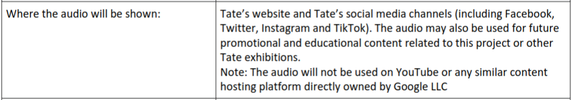

### Inquiring into access as configuration

Access in my research can be addressed and understood in so many of the actions I have taken, from running events, making websites and infrastructures, learning to communicate and wiggle room with collaborators and even how I write academically right here. This has led me to reflect deeply on access-knowledge not only as a flexibility and capacity we build up around institutions and their norms through practice but also as one of the most divergent sites of impact to reconfigure complex systems from. By inquiring into access knowledge as configuration in practise, I aim to share how disability studies has inform my capacities for making room for the indeterminate needs and material limits of people and technologies around the sedimented norms of institutions. I have already written a lot on the many times I have encountered frictious access prepared by others and made me feel out of place, like at the [02.01_The_research_table](../../02_Crip-Tic_of_Vignettes/02_entries/02.01_The_research_table.md), [02.02_The_computing_table](../../02_Crip-Tic_of_Vignettes/02_entries/02.02_The_computing_table.md) or the [02.03_The_operating_table](../../02_Crip-Tic_of_Vignettes/02_entries/02.03_The_operating_table.md), or access that has made me feel understood and affirmed in the [02.04_The_crip_table](../../02_Crip-Tic_of_Vignettes/02_entries/02.04_The_crip_table.md). Here though, I find it more pressing to share my experiences and inquiries around forming access with and for others, as well as reflecting on my requesting of access from institutions as reconfiguring practicises. Inquiring into these orientations, of both access requester towards institutions and collective provider within community work, I aim to trouble the sedimented division of user/designer/expert roles in practises of configuring access. This inquiry gives shape to configure-able methods, and how I aim to approach and care for these normalised institutional limits, forming wiggle room within and around them. In doing this though, I also aim to not so easily collapse pre-configure roles, like users, workshop participants and presenter, but instead be intimate with the intersectional capacities of those involved and how each person can orient themselves in locality together to configure collective access. 

#### Collective Access-Knowledge as Configuration

To render this inquiry around Configure-Able methods I will focus on an initial attempt to meet people's access needs at a workshop I ran and which has inform the initial emergence of these methods. This was a workshop called Configure-Able Infrastructures I organised with NEoN digital. This was both my first attempt at a UKRI funded Knowledge Exchange (KE) but more importantly here, it was my first clear attempt at putting on an accessible workshop, and so has given me many misfittings, frictions and disorienting factors to reflect and learn from. These workshops were manifested as a place to explore and exchange dialogues of digital accessibility outside of big tech services, and was hosted by NEoN Digital Arts, a community based organisation focusing on digital access. I invited two groups to share their work. One was M.E.L.T. a crip digital arts collaboration of Ren Britton and Iz Paehr, presenting their Access Server work. The other person I invited was Ai Carmela from SysterServer to accessibly share technical skills of feminist network practices. These workshops in retrospect worked out okay for my first attempt at an accessible workshop, but left me quite anxious about how well I had managed it. This was in part not just because access in action is a steep learning curve when coming from the ableist norms of academic institutions and open-source community alike. From these institutions, flexibility is not asked but silently/violently demanded of the user, students, researchers or person approaching them, as our soft crip bodies and needs are stretched to fit the valid normid user's capacities and form. This being said these frictions and misfittings provide a quality example of how access-knowledge understood as configuration can be a generative tool for analysing the relations, politics, norms and imaginaries holding the current configurations of systems in place and which don't let them contextually flex to the soft bodies or needs they come in touch with in context.

The focus of this inquiry is to reflect on the demands for bodies to be flexible by both academic and open-source institutional inflexibility in action. I also focus on the response to institutional inflexibility and the room for flexibility within the constellation of producers and presenters running the workshop. In this I aim to demonstrate how institutional norms reinforce roles of user/designer, prescribed/prescriber, where as communities actioned through forms of critical access can make wiggle room within how they contextualising their roles and relations beyond what is sedimented as inflexible. 

I will begin by orienting towards the workshops use of Free Open-Source Software (FOSS). I as an organiser had decided to try to run the workshop using FOSS platforms and services hosted by different communities. This was mainly out of curiosity of what access was possible within FOSS, but also to attempt a refusal to flex to the ableist norms of academia and big tech. The friction we had here originated from M.E.L.T. but reverberated among us, and came about due to this being an online workshop where we wanted to provide people with captions to access the workshops. The budget for this KE event was limited, so I oriented towards using auto-captions, and paying the presenters what I could. In trying to configure out a FOSS video call with auto-captioning, I realised that this just did not exist (within reach). Default installs of Jiitsi did not have it, and even though there was some documentation on how to do it, I had not found an instance of it. With Big Blue Button (BBB) it had room for manual captioning but no wiggle room to automate it. This absence was overpowering in some ways, and showed how the Ableist norms of FOSS did not centre accessibility or find it central to its future development. Access is very much was extra time for FOSS. It also surfaces that if we want to be flexible to people's access needs we have to all flex to the inflexible politics, relations and protocols of big tech as the "one best way". Here though we refused their inflexibility and instead oriented towards forming access around FOSS and away from big tech. To do this I providing a detailed “how to” for setting up a captioning system on a local machine. This sharing of knowledge and improvising of infrastructure made wiggle room for flexibility around how people improvise configurations of access-able alternatives to complicit big tech platforms. It also shares how through collaborative action we both felt design frictions, but made room to bridge that gap, improvise and flex the hard machines to wiggle some room within these misfittings for one afternoon. 

From this friction also came a generative conversation with Sabrina at NeoN, talking about auto-captioning compared to live captioning by a professional person or sonographer. We talked about how live-captioning by a person is not only more accurate but is itself a practice and an art form where they can add in more context but also creativity in the way they represent the dynamics and relations of what is being said. Here I did not want to replace the people who practice these vibrant and generative art forms, professions, and practitioners knowledges with clumsy and uniformed automation. When I think through access oriented like this, and as centring art and creaivity it again transforms the narrative of access from one of a burden and constraint, to one of joy and pleasure. In Lousie Hickman's video essay _Crip AI_ (2021), she takes this into even closer detail to question how these histories of crip centred practices of sonographers are being overuled and left out of the dialogue when automating their practices and creative captions. Hamraie also shares how this is something of a norm when industrial design models approach disability, or even across fields. This is where these approaches do not navigate the methods, context or history of a field but just bluntly apply their own one best way of efficient design to it.   

With crip theory this unquestioned and prescribed move to the automation of access can also be understood as being more about relational politics which forcefully isolating disabled people by investing in ways to reduce funds for creative and intimate human centred practices of access-knowledge, care and joy within disabled lives. This isn't to say we shouldn't invest in their development, or to exclude the disabled people that might prefer these technologies to a person, but it is to make space for the option. It is like Hickman's Crip AI, which lays down the terms of if this is happening to us, we are making room in it to bring are backgrounds with us.

Being honest in these workshops it was a mix of institutional inflexibility from KE funds to not support this type of access by default but also my unknowing of how to access more funds that led me to improvise this automated access. Here though instead of have the capacity to make room for better access and the captioning as art and joy full, we did manifest ways to form automated access without being entangled in the complicit "one best way" of big tech. With this I aim to demonstrate how these access frictions not only formed a generative place for us to locally and collectively analyse the configuration of automated creative captions and FOSS, but also materially configure our own improvised alternatives then and there.

From another orientation emerged a second friction from this workshop, with just as much inflexibility but this time coming from the academic institution. This friction came from the simple action of getting funds to pay individuals that had already been awarded to me to run from UKRI through the KE scheme. This fairly simple task became inaccessible to me, not because the money was not declared, but because the process itself was not clear or accessible, leaving me un-agential and unable to do this simple task. The background to this moment is that efficiently my departments admin team had been fired and they had hired new people but not trained them. In doing so made the practices they were hired to do inaccessible to both them and to requesting staff like me. In my context this meant spending months emailing back and forth with these admin "experts" trying to get them to pay the participants the money that was allocated for them. The lack of access here was shown in how I, as an early career researcher doing these things for the first time did not know exactly what to tell the admin person. In the opposite direction as a un-trained administrator, nor could they guide me to the right forms and process. In full there was no flex-ability for us to meet in the middle (even with a slight gap).

I ended up resolving this by reaching out to my supervisor, who advised me on emailing another experienced admin who was more experienced and flexible. They managed to get the payments for participants sorted in one afternoon, slightly less that three months. Even still here there were complexities with getting some people paid due to state regulations. This shows how this configuration of knowledge exchange by academic institutions and their funding bodies like UKRI only make room for certain imagined bodies or normid users to be present and felt, those that know who to ask, and what form to fill in already, no matter those let on the campus or in the state. In this inflexibility these institutions making certain other sorts of research by those not used to these sedimented processes slow to almost static. In this case here, if a person needed help accessing the administrational logics of these institutions or sit in the grey areas of state regulations you are waylaid and invalidated from sharing your knowledge, experience and practices in this ecology, or at least getting paid to do so. This systemic institutional invalidation, hiding and silencing of certain bodies and experiences is well known, but what I highlight here is that it was again us as a group who made room for and improvised a local flexible collective access within this institutional background so that it could come into contact with and be reoriented by these radical access frictions and their generative knowledges.

#### Requesting Access as Configuration

Moving on from the frictions within the Configure-Able Infrastructures workshops, I now move to trouble the role of requesting access from institutions through relational and political crip demands and the room that makes for reconfiguration. Here I am reflecting on the calls for friction in the _Crip Tehcnoscience Maifesto_ (Hamraie & Fritsch, 2019), of making direct actions of access, of cutting curbs in barriers, politics and sociotechnical relations. Here though I want to share how requesting access to institutions on these crip terms can create wiggle room and flexibility in these hard systems not only the individuals life of the requester, but those in a wide scope of crip intersectional politics and struggle. This sees access as community leverage and interdependent resistance using these systems to enable refusal of certain politics but also most importantly care for other orientations. Hamraie and Fritsch's examples present direct action towards normalised ableist public infrastructure, but here I wiggled room into an access request I made to an institution that brought in these intersectional crip politics. This maybe aligns more with what Britton writes in _On Rehearsing Access_ (Britton, 2024), and quoting Hedva's Access Rider[^1m], where they ask what real and permanent change their demands of access can make to institutions. The request I am reflecting on here is when I produced an audio piece for Tate’s electric dream FM on crip big-tech disobedience, where I talked about fermenting foods and feelings as a crip erotic technology. This was their accessible audio exhibition that accompanied the Electric Dreams retrospective, which presented an impressive catalogue of arts at the intersection of science and technology before the internet. Here in this extra time around the exhibition for access, I used this platform to not only highlight crip erotics of care, embodied practice and disobedient relational refusal, but most importantly here, test what access as a request can enable when thought understood as intersectionaly political. This in many ways is only a small movement but it highlights the configuring leverage, flex-ability and wiggle room a user can request and make within an institution.

Part of their default contract asked for me was to agree that my recording be published by them for promotion on multiple big tech social media platforms. I decided to test how a relational access request, one of refusing certain violent politics and infrastructures would be negotiated by this institution. To do this I asked within my access rider/requests that my recorded material boycott and not be shared on google’s platforms. I would have liked to have tried to boycott more of the big tech groups for their complicity to and enabling of many of the ongoing mass disablements and the ableist norms of efficient automation and the futures they enact. I thought to try small though and see what wiggle room this sedimented context and hardened institution had capacity for when in touch with a crip user like me. I also felt like I had more leverage to do this as they seemed to be running a little last minute, and I think I filled the “disabled voice” that lacked from the “accessible platform”. After the request things went quiet for a few days, but after a little time I got a reply and contract with this boycott formalised in writing (+@fig:google). I know this is a small gesture, and one that in many ways may have not made much change, but it opens up again to demonstrate the capacity intersection crip access riders and their requests have within configuring practice, both politically, relationally and materially. In this small gesture is the promise that access as a disobedient request can make institutions wiggle, make space, and be in dialogue with relational understandings of access.

{#fig:google}

These inquiries into configure-able methods and configuring access aim to give an insight into how crip studies and access-knowledge can reconfigure configuration. They have set a basis to rethink how the boundary between user/designer, requester/provider and body/institution are delineated. In the de-sedimentation of delineation it moves us from a need to cure the other or invalidate the frictions felt from boundaries but instead care for how we can oriented towards and make room for access to transform the sedimented inflexibility of institutions. These methods orients to groups in context collectively feeling out material relations and caring for their limits in a way that generates unknowable possibilities. Each action of access an affirmation of life, each affirmation a promise of a crip future to come.

[^1m]: "It would be so cool, and you’d make me and my friends and many others very happy, and you’d increase the attendance of your events by a lot, and you’d become a working part of building the kind of world that needs to be built, if you would follow this document not just for me, but for all your work in the future." (Hedva, 2019)

